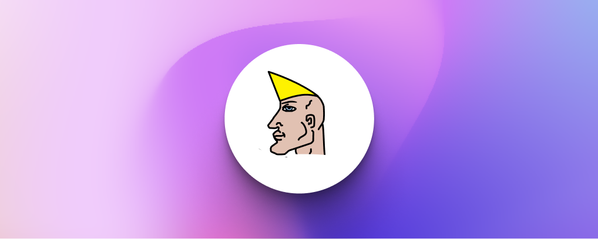

<h1><p align="center"></p></h1>


# Chadscan Backend

Production Website: https://chadscan.com

Dev URL: https://brave-ramanujan-0fe091.netlify.app/


Frontend repo: https://github.com/IDEP-network/blockexplorer-front

Chadscan is the first block explorer for the IDEP network. It provides information oт the overall network operations, governance details, validators and much more.
The backend is currently a fork from cosmoscan.

Dependency:
 - Clickhouse
 - Mysql
 - Cosmos node
 - Golang

## How to run ?
At first you need to configure the config.json file.
```sh
cp config.example.json config.json
```
Next step you need to build and run application.
#### Docker-compose way:
```sh
cp docker-compose.example.yml docker-compose.yml
cp docker/.env.example .env
cp docker/clickhouse-users.xml.example docker/clickhouse-users.xml
```
> don`t forget set your passwords
```sh
docker-compose build && docker-compose up -d
```
#### Native way:
> at first setup your dependency and set passwords
```sh
go build && ./cosmoscan-api
```
